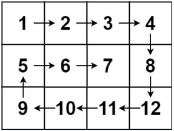

# 11. 盛最多水的容器

## Description

```Markdown
给定一个长度为 n 的整数数组 height 。有 n 条垂线，第 i 条线的两个端点是 (i, 0) 和 (i, height[i]) 。

找出其中的两条线，使得它们与 x 轴共同构成的容器可以容纳最多的水。

返回容器可以储存的最大水量。

说明：你不能倾斜容器。

示例 1：
```



```Markdown
输入：[1,8,6,2,5,4,8,3,7]
输出：49
解释：图中垂直线代表输入数组 [1,8,6,2,5,4,8,3,7]。在此情况下，容器能够容纳水（表示为蓝色部分）的最大值为 49。
示例 2：
输入：height = [1,1]
输出：1

提示：
n == height.length
2 <= n <= 105
0 <= height[i] <= 104
```

## Solution

1. 双指针
2. 双指针向内收缩
   > 假设状态 S(i,j)下 h[i]<h[j] ，在向内移动短板至 S(i+1,j) ，则相当于消去了 S(i,j−1),S(i,j−2),...,S(i,i+1)状态集合。而所有消去状态的面积一定都小于当前面积（即 <S(i,j)），因为这些状态：
   > 短板高度：相比 S(i,j)相同或更短（即 ≤h[i] ）；
   > 底边宽度：相比 S(i,j) 更短；

## Code

```JavaScript
/**
 * @param {number[]} height
 * @return {number}
 */
var maxArea = function (height) {
    let l = 0
    let r = height.length - 1
    let res = 0
    while (l < r) {
        if (height[l] < height[r]) {
            res = Math.max(res, (r - l) * height[l])
            l++
        } else {
            res = Math.max(res, (r - l) * height[r])
            r--
        }
    }
    return res
};
let height = [1, 8, 6, 2, 5, 4, 8, 3, 7]
let ans = maxArea(height)
console.log(ans)
```

## Source

来源：力扣（LeetCode）
链接：<https://leetcode.cn/problems/container-with-most-water/description/>
