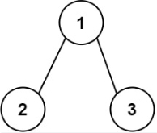
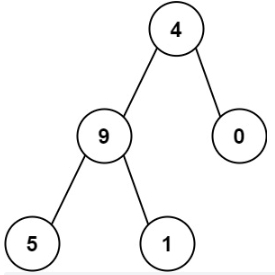

# 129. 求根节点到叶节点数字之和

## Description

```Markdown
给你一个二叉树的根节点 root ，树中每个节点都存放有一个 0 到 9 之间的数字。
每条从根节点到叶节点的路径都代表一个数字：

例如，从根节点到叶节点的路径 1 -> 2 -> 3 表示数字 123 。
计算从根节点到叶节点生成的 所有数字之和 。

叶节点 是指没有子节点的节点。

示例 1：
```



```Markdown
输入：root = [1,2,3]
输出：25
解释：
从根到叶子节点路径 1->2 代表数字 12
从根到叶子节点路径 1->3 代表数字 13
因此，数字总和 = 12 + 13 = 25
示例 2：
```



```Markdown

输入：root = [4,9,0,5,1]
输出：1026
解释：
从根到叶子节点路径 4->9->5 代表数字 495
从根到叶子节点路径 4->9->1 代表数字 491
从根到叶子节点路径 4->0 代表数字 40
因此，数字总和 = 495 + 491 + 40 = 1026
```

## Solution

1. 树
2. 维护一个 path，在 dfs 之前往 path 里放值，在 dfs 之后 pop 值
3. 当叶子节点的时候，当前 path 维护完毕，并清空 path

## Code

```JavaScript
/**
 * Definition for a binary tree node.
 * function TreeNode(val, left, right) {
 *     this.val = (val===undefined ? 0 : val)
 *     this.left = (left===undefined ? null : left)
 *     this.right = (right===undefined ? null : right)
 * }
 */

function TreeNode(val, left, right) {
    this.val = (val === undefined ? 0 : val)
    this.left = (left === undefined ? null : left)
    this.right = (right === undefined ? null : right)
}
/**
 * @param {TreeNode} root
 * @return {number}
 */
var sumNumbers = function (root) {
    let ans = 0
    let res = []
    let path = [root.val]
    const dfs = (n, path) => {
        if (!n) return
        if (!n.left && !n.right) {
            res.push([...path])
            return
        }
        if (n.left) {
            path.push(n.left.val)
            dfs(n.left, path)
            path.pop()
        }
        if (n.right) {
            path.push(n.right.val)
            dfs(n.right, path)
            path.pop()
        }
    }
    dfs(root, path)
    for (let i = 0; i < res.length; i++) {
        ans += Number(res[i].join(''))
    }
    return ans
};
let node_4 = new TreeNode(4, null, null)
let node_9 = new TreeNode(9, null, null)
let node_0 = new TreeNode(0, null, null)
let node_5 = new TreeNode(5, null, null)
let node_1 = new TreeNode(1, null, null)
node_4.left = node_9
node_4.right = node_0
node_9.left = node_5
node_9.right = node_1
let ans = sumNumbers(node_4)
console.log(ans)
```

## Source

来源：力扣（LeetCode）
链接：https://leetcode.cn/problems/sum-root-to-leaf-numbers
