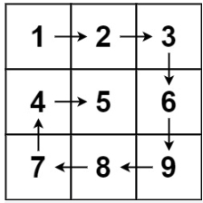

# 54. 螺旋矩阵

## Description

```Markdown
给你一个 m 行 n 列的矩阵 matrix ，请按照 顺时针螺旋顺序 ，返回矩阵中的所有元素。
示例 1：
```



```Markdown

输入：matrix = [[1,2,3],[4,5,6],[7,8,9]]
输出：[1,2,3,6,9,8,7,4,5]
示例 2：
```


```Markdown
输入：matrix = [[1,2,3,4],[5,6,7,8],[9,10,11,12]]
输出：[1,2,3,4,8,12,11,10,9,5,6,7]
 
提示：
m == matrix.length
n == matrix[i].length
1 <= m, n <= 10
-100 <= matrix[i][j] <= 100
```

## Solution

1. 矩阵，顺时针遍历
2. 四个指针，分别top、left、right、bottom
3. 先遍历最上面的，再最右面的，当left小于right，top小于bottom，会分别遍历最下面和最左面。

## Code

```JavaScript
/**
 * @param {number[][]} matrix
 * @return {number[]}
 */
var spiralOrder = function (matrix) {
    let top = 0
    let left = 0
    let right = matrix[0].length - 1
    let bottom = matrix.length - 1
    let ans = []
    while (left <= right && top <= bottom) {
        for (let i = left; i <= right; i++) {
            ans.push(matrix[top][i])
        }
        for (let j = top + 1; j <= bottom; j++) {
            ans.push(matrix[j][right])
        }
        if (left < right && top < bottom) {
            for (let i = right - 1; i > left; i--) {
                ans.push(matrix[bottom][i])
            }
            for (let j = bottom; j > top; j--) {
                ans.push(matrix[j][left])
            }
        }
        left++
        right--
        top++
        bottom--
    }
    return ans
};
let matrix = [[1, 2, 3], [4, 5, 6], [7, 8, 9]]
let ans = spiralOrder(matrix)
console.log(ans)
```

## Source

来源：力扣（LeetCode）
链接：https://leetcode.cn/problems/spiral-matrix
