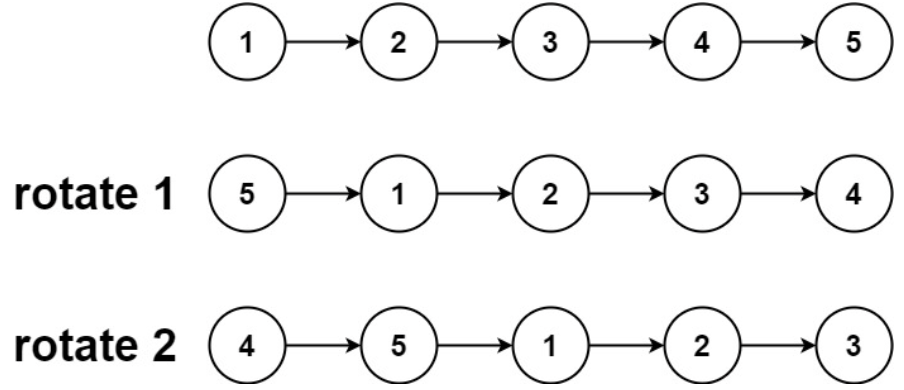
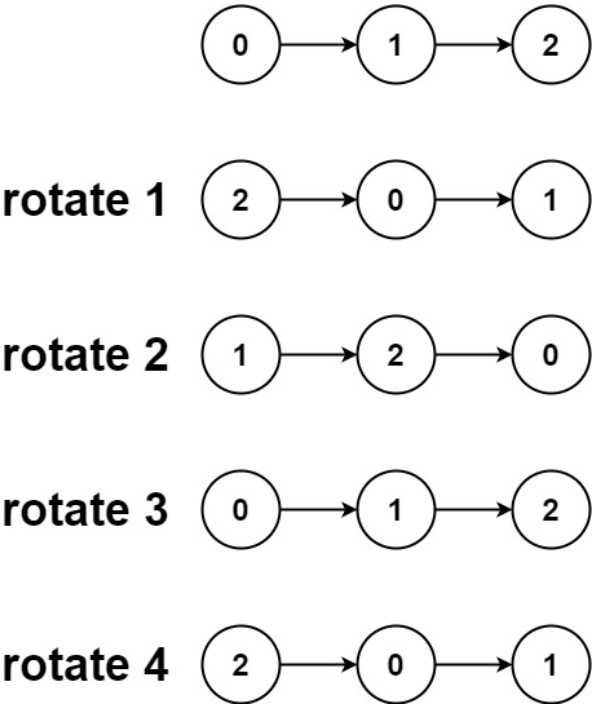

# 61. 旋转链表

## Description

```Markdown
给你一个链表的头节点 head ，旋转链表，将链表每个节点向右移动 k 个位置。
示例 1：
```



```Markdown
输入：head = [1,2,3,4,5], k = 2
输出：[4,5,1,2,3]

示例 2：
```



```Markdown
输入：head = [0,1,2], k = 4
输出：[2,0,1]

提示：
链表中节点的数目在范围 [0, 500] 内
-100 <= Node.val <= 100
0 <= k <= 2 * 109
```

## Solution

1. 第一种方法，切割成两个链表，再重新组装
   1. 其实反转链表，再移动，可以不关心这个反转
   2. 因为反转后，再向右移动两个
   3. 比如[1,2,3,4,5]，反转后得到[5,4,3,2,1],再移动k=2个元素得到[4,5,1,2,3]，如果按照这个模式，这个k，反映到真实的到链表上，其实是反转后移动k=1个元素。
   4. 那么题目为什么是k=2呢，可以不关心这个反转，从而理解这个k=2
   5. 因为其实就是把最后两个元素，拎出来作为头部链表，也就是得到[4,5]，原链表剩下[1,2,3]，然后组装变成[4,5,1,2,3]
   6. 但还有个情况是链表长度为len=3，但是k=4，这时候就需要`k = k % len`，得到我们需要的k
2. 第二种方法，简洁一点，自己的第一种有点冗长
   1. 也是先计算len 和 真实的k
   2. 找到链表的第n-k个节点，比如还是[1,2,3,4,5]，k为2
   3. 找到 `p = p.next` 找到链表的第n-k个节点，现在的p指向了3
   4. 最重要的三个语句是`tail_p.next = head` 使得尾巴5后面去接123
   5. `head = p.next` 头指针指向第n-k+1个节点，也就是45
   6. `p.next = null` [1,2,3]的3后面是null

## Code

### Code 1

```JavaScript
function ListNode(val, next) {
  this.val = val === undefined ? 0 : val;
  this.next = next === undefined ? null : next;
}

/**
 * @param {ListNode} head
 * @param {number} k
 * @return {ListNode}
 */
var rotateRight = function (head, k) {
  let p = head;
  let len = 0;
  while (p) {
    p = p.next;
    len++; // 计算长度
  }
  k = k % len; // 得到真的k
  let len_1 = len - k;
  p = head;
  let q = new ListNode(0, null);
  let q_copy = q;
  while (p) {
    len_1--;
    if (len_1 === 0) {
      q.next = p.next; // 分割两端链表
      p.next = null;
      break;
    } else {
      p = p.next;
    }
  }
  while (q) {
    if (q.next) {
      q = q.next;
    } else {
      q.next = head; //重新组装链表
      break;
    }
  }
  return q_copy.next;
};

let node_1 = new ListNode(1);
let node_2 = new ListNode(2);
let node_3 = new ListNode(3);
let node_4 = new ListNode(4);
let node_5 = new ListNode(5);

node_1.next = node_2;
node_2.next = node_3;
node_3.next = node_4;
node_4.next = node_5;

let k = 2;
let ans = rotateRight(node_1, k);
console.log(ans);
```

### Code 2

```JavaScript
var rotateRight = function (head, k) {
  if (!head || !k) return head;
  let p = head;
  let len = 0;
  let tail_p = new ListNode(0, null);
  while (p) {
    len++;
    tail_p = p;
    p = p.next;
  }
  k = k % len;
  let len_1 = len - k;
  p = head;
  for (let i = 0; i < len - k - 1; i++) {
    p = p.next; //找到链表的第n-k个节点
  }
  tail_p.next = head; // 尾巴5后面去接123
  head = p.next; // 头指针指向第n-k+1个节点，也就是45
  p.next = null; // [1,2,3]的3后面是null
  return head;
};
```

## Source

来源：力扣（LeetCode）
链接：<https://leetcode.cn/problems/rotate-list/description/>
